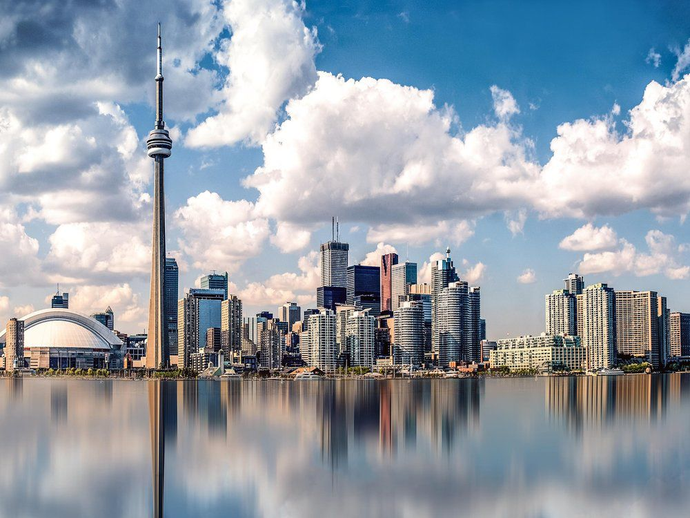
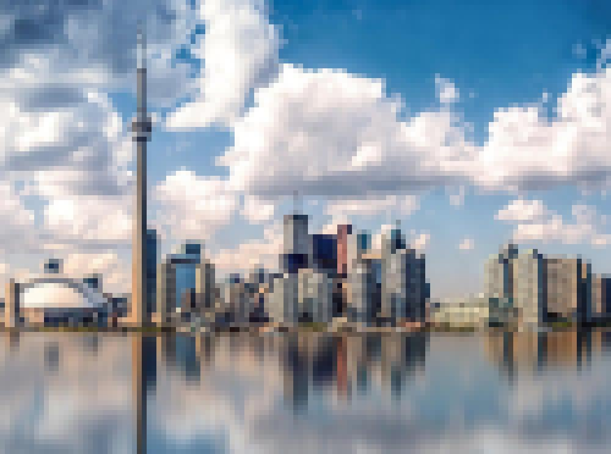
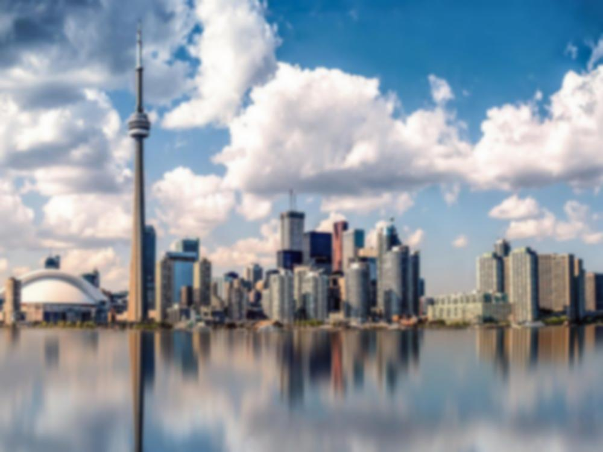
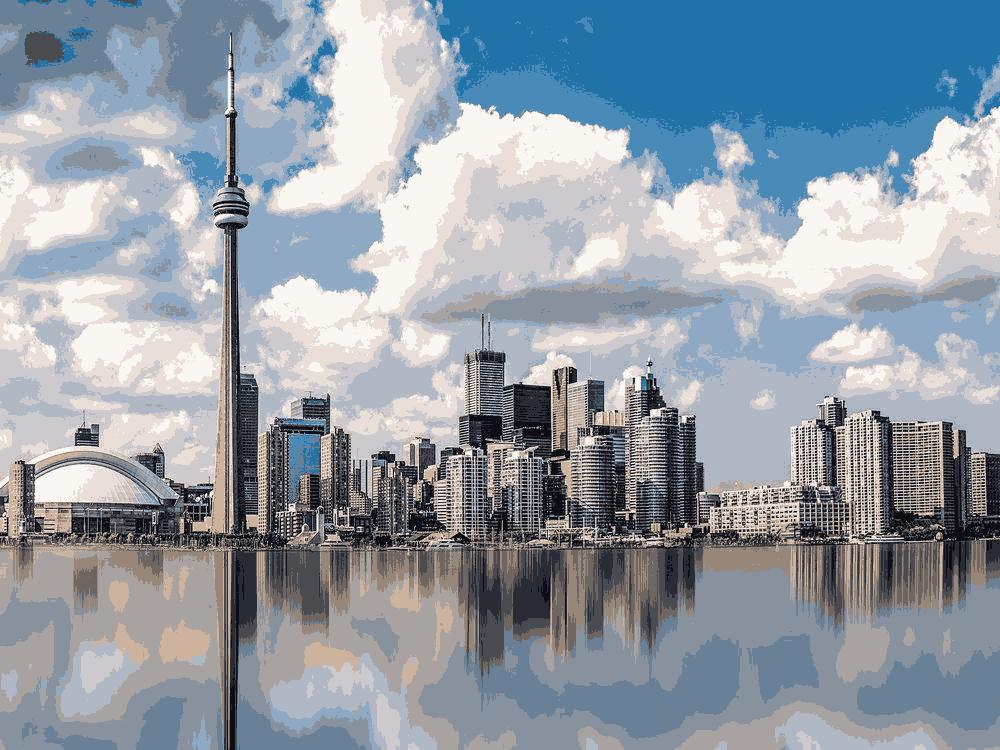
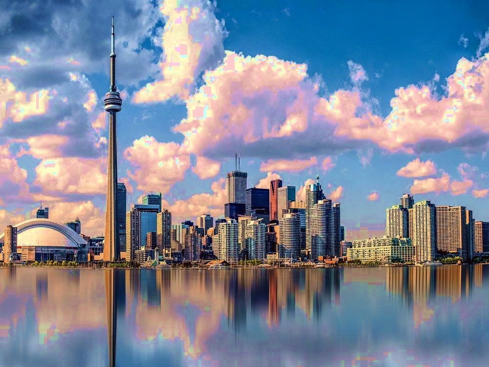
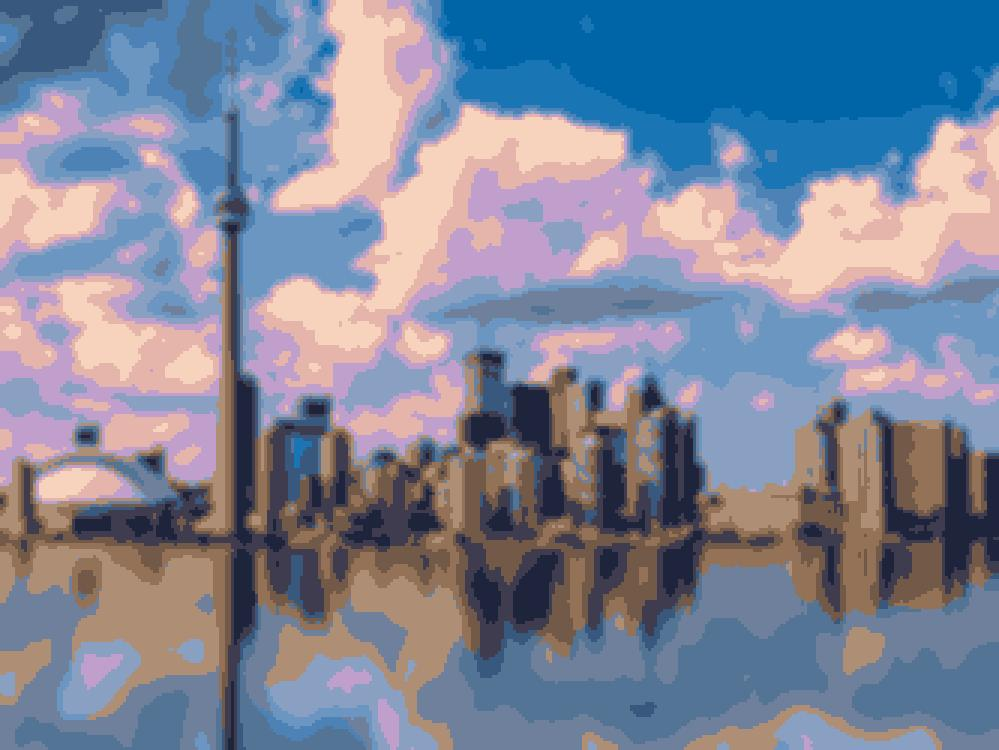

# Pixelator
Image filter that applies four unique filters to pixelate, smooth, limit palette size, and adjust saturation for a jpg or png image.

Base image
 

The first filter applies a mean filter to average groups of pixels and create super-samples. This gives the pixelated effect. Parameter "pixel_factor" sets the super-sample size (minimum of 1).
 

The second filter iterates through all super-samples and uses mean filtering to smooth the image. A super-sample cell colour is calculated as the average of itself and all surrounding neighbors. Parameter "smooth_iterations" sets the number of smooth steps performed on the image (0 to disable).
 

The third filter uses k-means clustering to limit the colour palette size. Parameter "palette_size" sets the number of clusters used (0 to disable).
 

The fourth filter adjusts saturation level. Parameter "saturation" sets the saturation delta, set to +1 for maximum saturation and -1 for grey scale (0 to disable).
 

An example of an image with the four above filters combined.
 
